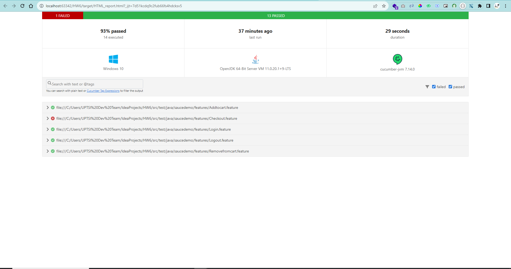

# Homework6 - SQA : Mengimplementasikan Automation Testing
### 🚀 java Development Kit Version
```xml
      <properties>
          <maven.compiler.source>11</maven.compiler.source>
          <maven.compiler.target>11</maven.compiler.target>
      </properties>
```
### Dependencies
```xml
      <dependencies>
        <dependency>
            <groupId>io.cucumber</groupId>
            <artifactId>cucumber-java</artifactId>
            <version>7.14.0</version>
            <scope>test</scope>
        </dependency>
        <dependency>
            <groupId>io.cucumber</groupId>
            <artifactId>cucumber-junit</artifactId>
            <version>7.14.0</version>
            <scope>test</scope>
        </dependency>
        <dependency>
            <groupId>junit</groupId>
            <artifactId>junit</artifactId>
            <version>4.12</version>
            <scope>test</scope>
        </dependency>
        <dependency>
            <groupId>org.seleniumhq.selenium</groupId>
            <artifactId>selenium-java</artifactId>
            <version>4.14.1</version>
        </dependency>
        <dependency>
            <groupId>org.junit.vintage</groupId>
            <artifactId>junit-vintage-engine</artifactId>
            <version>5.9.1</version>
            <scope>test</scope>
        </dependency>
        <!-- https://mvnrepository.com/artifact/io.github.bonigarcia/webdrivermanager -->
        <dependency>
            <groupId>io.github.bonigarcia</groupId>
            <artifactId>webdrivermanager</artifactId>
            <version>5.5.3</version>
            <scope>test</scope>
        </dependency>
        <!-- https://mvnrepository.com/artifact/io.cucumber/cucumber-picocontainer -->
        <dependency>
            <groupId>io.cucumber</groupId>
            <artifactId>cucumber-picocontainer</artifactId>
            <version>7.8.0</version>
            <scope>test</scope>
        </dependency>
        <!-- https://mvnrepository.com/artifact/org.slf4j/slf4j-api -->
        <dependency>
            <groupId>org.slf4j</groupId>
            <artifactId>slf4j-api</artifactId>
            <version>2.0.7</version>
        </dependency>
        <!--https://mvnrepository.com/artifact/org.slf4j/slf4j-simple-->
        <dependency>
            <groupId>org.slf4j</groupId>
            <artifactId>slf4j-simple</artifactId>
            <version>2.0.0</version>
            <scope>runtime</scope>
        </dependency>
    </dependencies>
```

### Report

